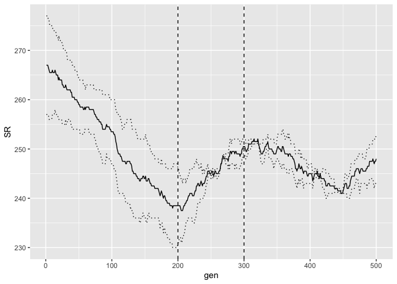
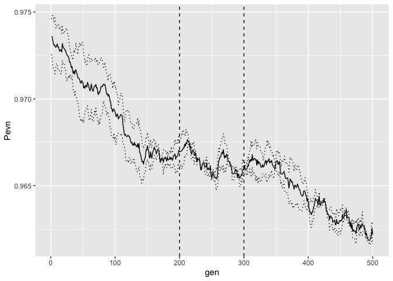
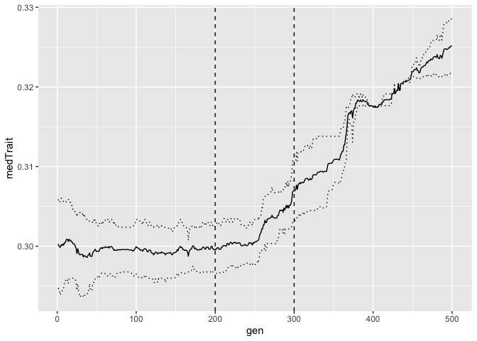
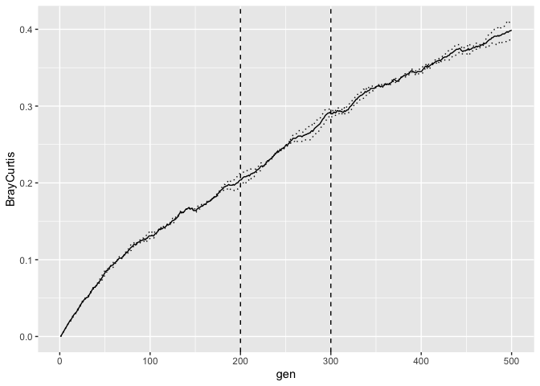

Using the `ecolottery` package to simulate a community migrating from a 'Source' to a 'Sink' via a 'Dispersal' environment. 


```r
require(ecolottery)
require(ggplot2)
```
Load custom functions for random draw migration simulations.


```r
source("functions/forward_mod.R") # custom `forward` function to output communities directlyto csv
source("functions/forward_shuffle.R") # custom function to shuffle microbiome amongst multiple hosts dispersing together (e.g. whales migrating together)
```
Set up a niche filter function and constant parameters used in all pools/sims. Baseline (i.e. before integrating niche components) probability of an organism dying. Probability of dead inviduals being replaced by immigrants. 


```r
filt_gaussian <- function(t, sigma, x) exp(-(x-t)^2/(2*sigma^2))

prob_imm <- 0.3  #immigration
prob_death <- 0.05 #death baseline
lim_sim <- TRUE #limit similarity
coeff_limsim <- 1
lim_sim_sigma <- 0.05
nind <- 500 #size of microbiome - keeping small for testing

cohort_size <- NULL # number of co-dispersing hosts - if NULL single host disperses with no 'shuffling'
```
Species pool for the Source environment.

```r
source_start <- read.csv(file = "data/source_start.csv", row.names = 1)
```
Species pool for the Dispersal environment.

```r
dispersal_start<-read.csv(file = "data/dispersal_start.csv", row.names = 1)
```
Species pool for the Sink environment.

```r
sink_start<-read.csv(file = "data/sink_start.csv", row.names = 1)
```
Add random noise to individual species traits to emulate within-species trait variability. 

```r
source_start$trait <- truncnorm::rtruncnorm(1, a = 0, b = 1, mean = source_start$trait, sd = 0.02)
sink_start$trait <- truncnorm::rtruncnorm(1, a = 0, b = 1, mean = sink_start$trait, sd = 0.02)
dispersal_start$trait <- truncnorm::rtruncnorm(1, a = 0, b = 1, mean = dispersal_start$trait, sd = 0.02)
```
Parameters for each stage of the simulation.

```r
ngen_source <- 200 #Number of generations in the Source environment
ngen_dispersal <- 100 #Number of generations in the Dispersal environment
ngen_sink <- 200 #Number of generations in the Sink environment

filt_source <- 0.3 # Niche filter/selection in Source
filt_dispersal <- 0.7 # Niche filter/selection in Dispersal - will transition generation by generation; src -> plg -> snk e.g. 0.3->0.4 ... ->0.7 -> 0.6... ->0.3
filt_sink <- 0.4 # Niche filter/selection in Sink
```
Generate a list of filtering functions to pass to shuffle code - allows for gradual niche filter change AND shuffling (if using).

```r
filt_dispersal_seq <- c(seq(filt_source, filt_dispersal, length.out = ngen_dispersal*0.1), rep(filt_dispersal, ngen_dispersal*0.8), seq(filt_dispersal, filt_sink, length.out = ngen_dispersal*0.1)) #work out sequence steps for niche filt
filtfun <- function(flt) {force(flt)
  fun2 <- function(x) {filt_gaussian(flt, 0.05, x)}
  return(fun2)}

filt_dispersal_lst <- vector("list", length(filt_dispersal_seq))
for (i in 1:length(filt_dispersal_seq)){
  filt_dispersal_lst[[i]] <- filtfun(filt_dispersal_seq[i])
}
```
Set the number of iterations/re-runs. 2 for demonstrative purposes.

```r
n_iterations <- 2
```
Run simulation. Returns only iteration number as results are output directly to file. 

```r
lapply(1:n_iterations, FUN = function(iter){ 

#source
initial <- lapply(1:ifelse(is.null(cohort_size), 1, cohort_size), function(x){source_start[sample(nrow(source_start), nind, replace=FALSE), ]})
source_section <- forward_shuffle(init_pools = initial, prob = prob_imm, prob.death = prob_death, gens = ngen_source, pool = source_start, filt = function(x) filt_gaussian(filt_source, 0.05, x), limit.sim = lim_sim, coeff.lim.sim = coeff_limsim, sigm = lim_sim_sigma, keep = TRUE, cohort.size = cohort_size, shuffle.freq = 10, shuffle.prop = 0.1, iteration = iter, first.gen = 0, stage = "src")

#dispersal
dispersal_section <- forward_shuffle(init_pools = source_section, prob = prob_imm, prob.death = prob_death, gens = ngen_dispersal, pool = dispersal_start, filt = filt_dispersal_lst, limit.sim = lim_sim, coeff.lim.sim = coeff_limsim, sigm = lim_sim_sigma, keep = TRUE, cohort.size = cohort_size, shuffle.freq = 10, shuffle.prop = 0.1, iteration = iter, first.gen = ngen_source, stage = "plg")

#sink
sink_section <- forward_shuffle(init_pools = dispersal_section, prob = prob_imm, prob.death = prob_death, gens = ngen_sink, pool = sink_start, filt = function(x) filt_gaussian(filt_sink, 0.05, x), limit.sim = lim_sim, coeff.lim.sim = coeff_limsim, sigm = lim_sim_sigma, keep = TRUE, cohort.size = cohort_size, shuffle.freq = 10, shuffle.prop = 0.1, iteration = iter, first.gen = ngen_source+ngen_dispersal, stage = "snk")
return(iter) #data are output to file
})
```

```
## [[1]]
## [1] 1
## 
## [[2]]
## [1] 2
```
Read in and summarise simulation outputs for plotting. 

```r
fldrs <- paste0("output/", list.files(path = "output", pattern = "iteration"))

allRuns_summary <- do.call(rbind, lapply(1:length(fldrs), FUN = function(iter){
fldr <- fldrs[iter]

sub_fldrs <- list.files(fldr)[-1] #drop call.csv output file

do.call(rbind, lapply(1:length(sub_fldrs), function(sub_it){
pth <- paste0(fldr, "/", sub_fldrs[sub_it])

file_lst <- paste0(pth, "/", list.files(pth, pattern = "generation"))

splist <- lapply(file_lst, function(x){gsub("_sh", "", data.table::fread(x)$sp, perl = TRUE)}) #remove shuffle suffix

data.frame(iter = iter, sub_it = sub_it, gen = 1:length(file_lst), SR =sapply(splist, function(x){
		SR <- length(unique(x))}, USE.NAMES = FALSE), Pevn = sapply(splist, function(x){
		tab <- table(x)
		Pi <- tab/sum(tab)
		Piel <- (-1 * (sum(Pi * log(Pi))))/log(length(tab))
		}, USE.NAMES = FALSE), 
			medTrait = sapply(file_lst, function(x){median(data.table::fread(x)$trait)}),
			BrayCurtis = sapply(splist, function(x){

				first_data  <- table(splist[[1]])
				tab <- table(x)
				comb_data <- as.matrix(dplyr::bind_rows(first_data, tab))
				comb_data[is.na(comb_data)] <- 0
				
				return(1 - ((2*sum(matrixStats::colMins(comb_data))) / (sum(first_data) + sum(tab))))
				}))
}))

}))
```
Basic plotting of richness, evenness, median species trait, and Bray-Curtis Dissimilarity over time.

```r
ggplot(data = allRuns_summary, aes(x = gen, y = SR))  + stat_summary(fun=min, geom="line", linetype = "dotted") + stat_summary(fun=max, geom="line", linetype = "dotted") + stat_summary(fun=mean, geom="line") + geom_vline(xintercept = ngen_source, linetype = "dashed") + geom_vline(xintercept = ngen_source + ngen_dispersal, linetype = "dashed")
```

<!-- -->

```r
ggplot(data = allRuns_summary, aes(x = gen, y = Pevn)) + stat_summary(fun=min, geom="line", linetype = "dotted") + stat_summary(fun=max, geom="line", linetype = "dotted") + stat_summary(fun=mean, geom="line") + geom_vline(xintercept = ngen_source, linetype = "dashed") + geom_vline(xintercept = ngen_source + ngen_dispersal, linetype = "dashed")
```

<!-- -->

```r
ggplot(data = allRuns_summary, aes(x = gen, y = medTrait)) + stat_summary(fun=min, geom="line", linetype = "dotted") + stat_summary(fun=max, geom="line", linetype = "dotted") + stat_summary(fun=mean, geom="line") + geom_vline(xintercept = ngen_source, linetype = "dashed") + geom_vline(xintercept = ngen_source + ngen_dispersal, linetype = "dashed")
```

<!-- -->

```r
ggplot(data = allRuns_summary, aes(x = gen, y = BrayCurtis)) + stat_summary(fun=min, geom="line", linetype = "dotted") + stat_summary(fun=max, geom="line", linetype = "dotted") + stat_summary(fun=mean, geom="line") + geom_vline(xintercept = ngen_source, linetype = "dashed") + geom_vline(xintercept = ngen_source + ngen_dispersal, linetype = "dashed")
```

<!-- -->
